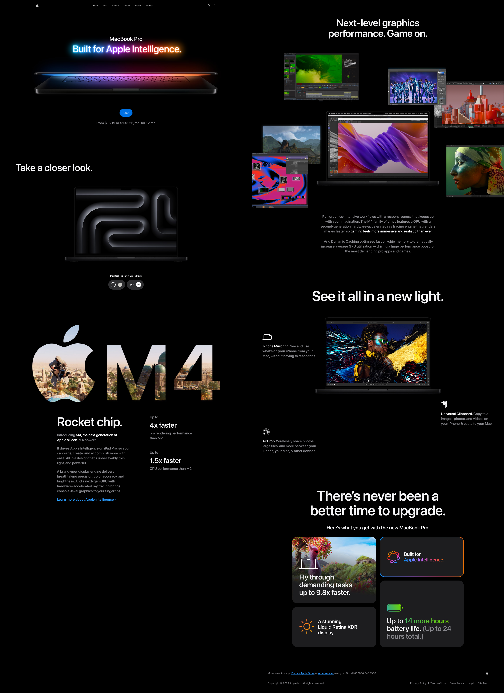

<div align="center">

# 🚀 Apple MacBook Website - Interactive Product Viewer

A fully animated, scroll-driven React + Three.js experience featuring interactive MacBook models.

</div>

---

<div align="center">

### 🛠 Built With

[](https://reactjs.org/)
[](https://threejs.org/)
[](https://github.com/pmndrs/zustand)
[](https://gsap.com/)
[](https://vitejs.dev/)

</div>

---

## 🧠 Overview

**Apple MacBook Website** is a fully animated and responsive 3D product viewer built with React, Three.js, and GSAP.  
It features scroll-driven model switching, video-textured features, and realistic lighting — all optimized for mobile and desktop.

Designed for developers and designers who want to explore advanced animation techniques and modular component-based architecture in a 3D interface.

---

## 📸 Demo



---

## 🌐 Live Demo

[](https://macbook-showcase.vercel.app/)

---

### 🔍 Highlights

- ✅ Responsive design
- ✅ Smooth animations and transitions
- ✅ Reusable UI components
- ✅ Content-managed sections
- ✅ Scalable, modular codebase
- ✅ Beautiful visuals and interactive elements

---

## ✨ Features

- 🎯 Interactive MacBook 3D viewer with color & size switching
- 🎞️ Scroll-triggered video texture transitions
- 🌈 GSAP-driven animations and timeline control
- 💡 Zustand-powered global state management
- 🌐 Fully responsive for desktop, tablet, and mobile
- 🎨 Modern UI with Tailwind-style utility classes

---

## 📦 Project Structure

```bash
📁 src/
├── components/           # All core components
│   ├── three/            # 3D model and viewer components
│   └── models/           # MacBook 3D model files
├── store/                # Zustand global state
├── constants/            # Static config and data
├── App.jsx               # Root layout
├── main.jsx              # Entry point
```

---

## 🚀 Getting Started

### 1. Clone the repository

```bash
git clone https://github.com/Oran01/Apple-MacBook-Website.git
cd Apple-MacBook-Website
```

### 2. Install dependencies

```bash
npm install
```

### 3. Start the development server

```bash
npm run dev
```

### 4. Open in your browser

```bash
http://localhost:5173
```

---

## ▶️ Tutorial Followed

This project was originally inspired by and built following a YouTube tutorial by [JavaScript Mastery](https://www.youtube.com/@javascriptmastery):

- 📺 [Build an Immersive 3D Product Website with React & Three.js](https://www.youtube.com/watch?v=DEeaT6FxEws&list=WL&index=9&t=25s)

---

## 🤝 Contributing

Feel free to fork this repository and submit pull requests to improve the project!

⭐ If you enjoyed this project, please consider giving it a star!
